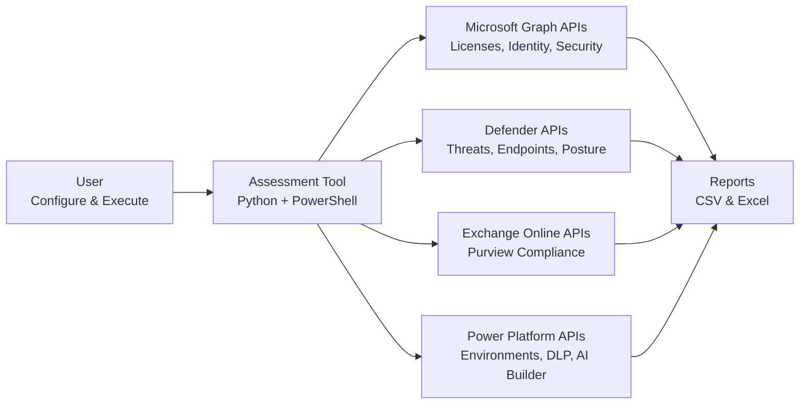
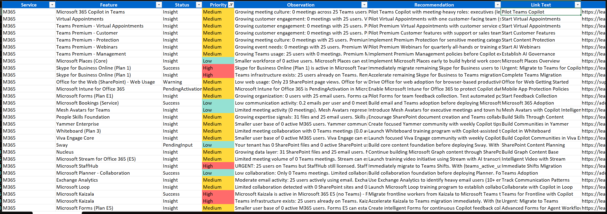

# Automated Readiness Assessment for Microsoft 365 Copilot and Agents

Microsoft 365 Copilot represents a transformative shift in workplace productivity through AI-powered assistance. This automated assessment tool helps organizations evaluate their readiness for deploying Microsoft 365 Copilot and AI agents by analyzing licensing, security posture, compliance configurations, and infrastructure across the M365 ecosystem.

## Assessing Copilot Readiness

Determining whether your organization meets the prerequisites for Microsoft 365 Copilot deployment requires evaluating licensing, security controls, compliance policies, and infrastructure across multiple service areas. Traditional assessment approaches rely on manual questionnaires and subjective evaluation.

**Automated Readiness Assessment** provides an objective, data-driven alternative by retrieving data from Microsoft APIs to analyze your actual tenant configuration and generate actionable recommendations.

## Automated Readiness Assessment

Automated Readiness Assessment is an evolution of manual evaluation processes. It uses a script-based approach to analyze current configurations across six M365 service areas. High-level workflow:

Each component:

- **User** - Clone repository, execute Python script with command-line options to select tenant and services (or configure `params.py`)
- **Assessment Tool** - Python orchestrator using PowerShell cmdlets and Microsoft APIs for data collection
- **Microsoft Graph APIs**
  - **Microsoft Graph**: Organization details, license assignments, identity protection, conditional access
  - **Defender for Endpoint**: Security recommendations, exposure scores, threat intelligence, incidents
  - **Exchange Online (Purview)**: DLP policies, sensitivity labels, retention policies
  - **Power Platform Management**: Environments, DLP boundaries, AI Builder, connectors
- **Service Areas**
  - **M365**: Copilot license consumption, Microsoft 365 Apps features, Teams Premium capabilities
  - **Entra**: Risky users, MFA enforcement, conditional access, B2B guest policies
  - **Defender**: XDR activation, endpoint coverage, security posture, OAuth app risks
  - **Purview**: Data classification, information governance, compliance boundaries
  - **Power Platform**: Environment governance, connector policies, AI Builder readiness
  - **Copilot Studio**: Agent licensing, custom agent deployment, conversation analytics

Querying APIs enables precise evaluation of configuration status across these design areas:

- **M365 Licensing**: Copilot license assignments, service plan provisioning status, feature availability
- **Security Posture**: Defender exposure scores, critical vulnerabilities, compromised accounts, OAuth app risks
- **Identity Protection**: Risky user counts, MFA coverage, conditional access policies, sign-in risk policies
- **Compliance Readiness**: DLP policy coverage, sensitivity label adoption, retention enforcement
- **Power Platform Governance**: Environment-level DLP, connector classification, AI Builder model monitoring
- **Copilot Studio**: Agent deployment readiness, authentication configurations, transcript retention

There are multiple design area evaluations implemented in Automated Readiness Assessment, each producing observations and prioritized recommendations.

### Benefits

**Time**: Assessment completes in seconds. Target specific services (e.g., only Defender + Purview) or run comprehensive analysis across all six areas. No manual form-filling or lengthy questionnaires.

**Cost**: Open-source tool with no licensing fees. Leverages existing Microsoft 365 admin permissions - no third-party agents or data exports required.

**Quality**: API-driven analysis eliminates guesswork from architectural discussions. Precise outcomes based on actual tenant configuration can be reviewed with stakeholders, auditors, and executive sponsors to improve quality further.

**Reproducibility**: Re-run assessments after implementing recommendations to measure progress. Timestamped reports enable tracking readiness improvements over time.

There are multiple design area evaluations implemented in Automated Readiness Assessment, each producing observations and prioritized recommendations.

## Assessment Report

The assessment generates detailed reports in both CSV and Excel formats, providing a comprehensive view of your Microsoft 365 Copilot readiness across all evaluated service areas:

The report includes:
- **Service Area**: M365, Entra, Defender, Purview, Power Platform, or Copilot Studio
- **Feature**: Configuration domain (Licensing, Security, Compliance, Governance)
- **Status**: Current state (Compliant, Warning, Not Configured)
- **Priority**: Recommended action priority (High, Medium, Low)
- **Observation**: Detailed description of what was discovered
- **Recommendation**: Specific action to improve Copilot readiness

Reports are timestamped (e.g., `m365_recommendations_20260106_143106.csv`) to track progress across multiple assessment runs.

## Next Steps

[Run Automated Readiness Assessment](RUN.md)

## Additional Resources

- [Microsoft 365 Copilot Overview](https://learn.microsoft.com/microsoft-365-copilot/microsoft-365-copilot-overview)
- [Copilot Adoption Framework](https://learn.microsoft.com/microsoft-365-copilot/microsoft-365-copilot-adoption)
- [Data, Privacy, and Security for Copilot](https://learn.microsoft.com/microsoft-365-copilot/microsoft-365-copilot-privacy)
- [Microsoft 365 Apps Admin Center](https://learn.microsoft.com/microsoft-365-apps/admin-center/overview)
- [Microsoft Entra (Identity)](https://learn.microsoft.com/entra/identity/)
- [Microsoft Defender for Endpoint](https://learn.microsoft.com/microsoft-365/security/defender-endpoint/)
- [Microsoft Purview (Compliance & Information Protection)](https://learn.microsoft.com/purview/purview)
- [Power Platform Admin Center](https://learn.microsoft.com/power-platform/admin/admin-documentation)
- [Microsoft Copilot Studio](https://learn.microsoft.com/microsoft-copilot-studio/)
